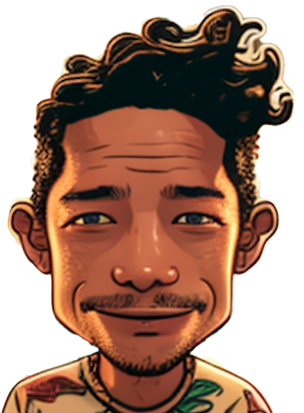

<!-- Improved compatibility of back to top link: See: https://github.com/othneildrew/Best-README-Template/pull/73 -->

<!--
*** Thanks for checking out the Best-README-Template. If you have a suggestion
*** that would make this better, please fork the repo and create a pull request
*** or simply open an issue with the tag "enhancement".
*** Don't forget to give the project a star!
*** Thanks again! Now go create something AMAZING! :D
-->

<!-- PROJECT SHIELDS -->
<!--
*** I'm using markdown "reference style" links for readability.
*** Reference links are enclosed in brackets [ ] instead of parentheses ( ).
*** See the bottom of this document for the declaration of the reference variables
*** for contributors-url, forks-url, etc. This is an optional, concise syntax you may use.
*** https://www.markdownguide.org/basic-syntax/#reference-style-links
-->
[![Contributors][contributors-shield]]()
[![MIT License][license-shield]][license-url]
[![LinkedIn][linkedin-shield]][linkedin-url]

<!-- PROJECT LOGO -->
 

  

<h3 align="center">Neon Cinema</h3>

  

   This is a website I built to showcase my work as a cinematographer. Created by: Paul Evans 
     
    🌴 💻 🎥 📸 🤙
     
    <a href="https://github.com/PaulEvans78/paulevans-dop/tree/master"><strong>Inspect the files »</strong></a>
     
     

<!-- TABLE OF CONTENTS -->

  
Table of Contents

  <ol>
    <li>
      <a href="#about-the-project">About The Project</a>
      <ul>
        <li><a href="#built-with">Built With</a></li>
      </ul>
    </li>
    <li>
      <a href="#getting-started">Getting Started</a>
      <ul>
        <li><a href="#prerequisites">Prerequisites</a></li>
        <li><a href="#installation">Installation</a></li>
      </ul>
    </li>
    <li><a href="#license">License</a></li>
    <li><a href="#contact">Contact</a></li>
    <li><a href="#social">Social</a></li>
    <li><a href="#websites">Websites</a></li>
    <li><a href="#acknowledgments">Acknowledgments</a></li>
  </ol>

<!-- ABOUT THE PROJECT -->
## Paul Evans fsf

[![https://paulevans-dop.com/][product-screenshot]](https://www.paulevans-dop.com)

 This is a website I built to showcase my work as a cinematographer. Paul Evans is UX / UI Designer & Frontend Developer. If you like what you see contact me at  paul.evans.creative@gmail.com

<!-- Here's a blank template to get started: To avoid retyping too much info. Do a search and replace with your text editor for the following: `PaulEvans78`, `portfolio`, `paulevanscreative/`, `paul-evans-3a74605/`, `gmail`, `paul.evans.creative`, `Portfolio`, `A website built in React to Showcase my work as a UX/UI designer, frontend Developer and Cinematographer.` -->

(<a href="#readme-top">back to top</a>)

### Built With

HTML CSS Javascript

(<a href="#readme-top">back to top</a>)

<!-- LICENSE -->
## License

Distributed under the MIT License. See `LICENSE.txt` for more information.

(<a href="#readme-top">back to top</a>)

<!-- CONTACT -->
## Contact

Email: paul.evans.creative@gmail.com

LinkedIn: [https://www.linkedin.com/in/paul-evans-3a74605/](https://linkedin.com/in/paul-evans-3a74605/)

Project Link: [https://github.com/PaulEvans78/paulevans-dop](https://github.com/PaulEvans78/paulevans-dop)

<!-- SOCIAL -->
## Social

Instagram - [@paulevanscreative/](https://www.instagram.com/paulevanscreative/) 

<!-- WEBSITES -->
## Websites

UX / UI and Frontend: [Portfolio](https://paulevans.surge.sh/)

Paul Evans fsf: [Showreel](https://paulevans-dop.com/)

(<a href="#readme-top">back to top</a>)

<!-- ACKNOWLEDGMENTS -->
## Acknowledgments

* [GitHub Pages](https://pages.github.com)

(<a href="#readme-top">back to top</a>)

<!-- MARKDOWN LINKS & IMAGES -->
<!-- https://www.markdownguide.org/basic-syntax/#reference-style-links -->
[contributors-shield]: https://img.shields.io/badge/contributors-1-orange.svg?style=flat-square
[contributors-url]: https://github.com/PaulEvans78/paulevans-dop/graphs/contributors
[forks-shield]: https://img.shields.io/github/forks/PaulEvans78/paulevans-dop.svg?style=for-the-badge
[forks-url]: https://github.com/PaulEvans78/paulevans-dop/network/members
[stars-shield]: https://img.shields.io/github/stars/PaulEvans78/paulevans-dop.svg?style=for-the-badge
[stars-url]: https://github.com/PaulEvans78/paulevans-dop/stargazers
[issues-shield]: https://img.shields.io/github/issues/PaulEvans78/paulevans-dop.svg?style=for-the-badge
[issues-url]: https://github.com/PaulEvans78/paulevans-dop/issues
[license-shield]: https://img.shields.io/badge/license-MIT-blue.svg?style=flat-square
[license-url]: https://github.com/PaulEvans78/paulevans-dop/blob/master/LICENSE.md
[linkedin-shield]: https://img.shields.io/badge/-LinkedIn-black.svg?style=flat-square&logo=linkedin&colorB=555
[linkedin-url]: https://linkedin.com/in/paul-evans-3a74605/
[product-screenshot]: img/doplandingpage.png
[Next.js]: https://img.shields.io/badge/next.js-000000?style=for-the-badge&logo=nextdotjs&logoColor=white
[Next-url]: https://nextjs.org/
[React.js]: https://img.shields.io/badge/React-20232A?style=for-the-badge&logo=react&logoColor=61DAFB
[React-url]: https://reactjs.org/
[Vue.js]: https://img.shields.io/badge/Vue.js-35495E?style=for-the-badge&logo=vuedotjs&logoColor=4FC08D
[Vue-url]: https://vuejs.org/
[Angular.io]: https://img.shields.io/badge/Angular-DD0031?style=for-the-badge&logo=angular&logoColor=white
[Angular-url]: https://angular.io/
[Svelte.dev]: https://img.shields.io/badge/Svelte-4A4A55?style=for-the-badge&logo=svelte&logoColor=FF3E00
[Svelte-url]: https://svelte.dev/
[Laravel.com]: https://img.shields.io/badge/Laravel-FF2D20?style=for-the-badge&logo=laravel&logoColor=white
[Laravel-url]: https://laravel.com
[Bootstrap.com]: https://img.shields.io/badge/Bootstrap-563D7C?style=for-the-badge&logo=bootstrap&logoColor=white
[Bootstrap-url]: https://getbootstrap.com
[JQuery.com]: https://img.shields.io/badge/jQuery-0769AD?style=for-the-badge&logo=jquery&logoColor=white
[JQuery-url]: https://jquery.com 

